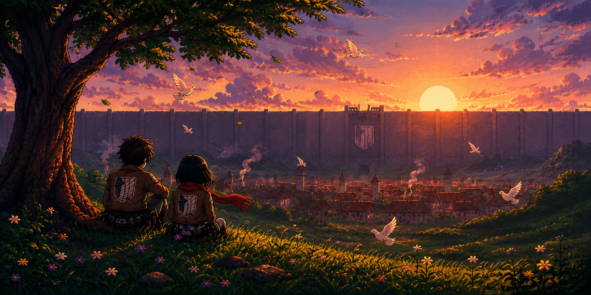

# Hi 👋, I'm Vivek

### Backend-focused Full-stack Developer

Building scalable backend systems, real-time collaborative applications, and browser automation tools with TypeScript.

  

---

## 🚀 About Me

- 🎓 Second-year Computer Science student
- 🌱 **Currently learning:** Distributed Systems, Redis, System Design, Kubernetes
- 💻 **Currently building:** Real-time collaborative apps, backend APIs, browser automation tools
- 🤖 **Exploring:** Playwright, intelligent browser agents, workflow automation
- 🎯 **Looking for:** Backend Internship • Open Source • Collaborations
- ⚡ **Fun fact:** I enjoy understanding how software works beneath the abstraction—from TCP packets to distributed systems.
- 📫 **Email:** `vivek.inz8@gmail.com`

---

# 🔗 Connect with Me

  

  

  

---

# 🛠 Tech Stack

### Languages

### Frontend

### Backend

### Databases & ORM

### DevOps & Cloud

---

# 🚀 Featured Projects

| Project | Tech | Description |
|----------|------|-------------|
| **[Stashly](https://github.com/vivekcore/stashly)** | React • Node • MongoDB • TS | Link & note manager with authentication |
| **[Excalidraw Lite](https://github.com/vivekcore/excalidraw-lite)** | Next.js • WebSockets • PostgreSQL • Prisma | Real-time collaborative whiteboard |
| **[Auction House](https://github.com/vivekcore/Auction_House)** | MERN • TypeScript | Escrow-based auction platform with automatic bid expiry |

---

# 📈 GitHub Activity

---

## ⚙️ Currently Exploring

- Distributed Systems
- Redis Pub/Sub
- WebSocket Scaling
- Browser Automation
- AI Browser Agents
- BullMQ Workers
- System Design

---

> *"Always curious about how systems work beneath the abstraction."*

